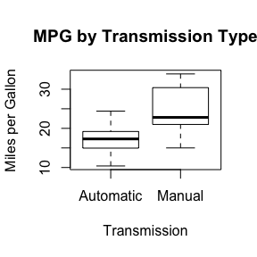

# Regression Models Project - Motor Trend Data Analysis
Yisong Tao  
August 23, 2015  

##Summary

In this report, we will analyze `mtcars` data set and explore the relationship between a set of variables and miles per gallon (MPG). Our goal is to answer two questions: “Is an automatic or manual transmission better for MPG” and "Quantify the MPG difference between automatic and manual transmissions". The results of our analysis show that cars with manual transmission tend to have better MPG values, and the weight of cars  and quarter mile time have significant impacts on quantifying the difference between cars with automatic and manual transmissions.

##Exploratory Data Analysis

First, we load the data set `mtcars` and rename the factors in `am` using descriptive words "Automatic" and "Manual".


```r
library(ggplot2)
data(mtcars)
head(mtcars) 
dim(mtcars)
mtcars$am <- factor(mtcars$am)
levels(mtcars$am) <- c("Automatic", "Manual")
```


```r
boxplot(mpg~am, data = mtcars,
        xlab = "Transmission",
        ylab = "Miles per Gallon",
        main = "MPG by Transmission Type")
```

 


```r
auto <- mtcars[mtcars$am == "Automatic",]
manual <- mtcars[mtcars$am == "Manual",]
t.test(auto$mpg, manual$mpg) #results hidden
```


The t-test shows that the mean for MPG of Manual transmission cars is 7.245 MPGs higher than that of Automatic transmission cars. And the p value of less than 0.05 suggests that there is significant difference between MPG values of Manual and Auto transimission cars, assuming other variable distribution are same between them.

##Regression Model

We start with a single variable regrssion model:

```r
SimpleModel <- lm(mpg ~ am, data=mtcars)
summary(SimpleModel) #results hidden
```
The adjusted R-squared value is 0.3385, which means Auto/Manual transmission alone only explains 33.85% of the variance in MPG.


```r
fullModel <- lm(mpg ~ ., data=mtcars)
summary(fullModel) #results hidden
```
The adjusted R-squared value is 0.8066, but none of coefficients are significant at 0.05 significant level.


```r
stepModel <- step(fullModel, k=log(nrow(mtcars)))
summary(stepModel) #results hidden
```
The step model comes to a model with 3 variables: `am`, `qsec` and `wt`, with adjusted R-squared value of 0.8336 and all coefficients are significant at 0.05 significant level.

From the appendix plot 1, we think there's a correlation between `am` and `wt`, that automatic transmission cars tend to be heavier. Let's try to improve our model by including interaction between `am` and `wt`.

```r
amwtIntModel <-lm(mpg ~ wt + qsec + am + wt:am, data=mtcars)
summary(amwtIntModel)$coef 
```

```
##              Estimate Std. Error   t value     Pr(>|t|)
## (Intercept)  9.723053  5.8990407  1.648243 0.1108925394
## wt          -2.936531  0.6660253 -4.409038 0.0001488947
## qsec         1.016974  0.2520152  4.035366 0.0004030165
## amManual    14.079428  3.4352512  4.098515 0.0003408693
## wt:amManual -4.141376  1.1968119 -3.460340 0.0018085763
```
The adjusted R-squared value is 0.8804, which means our model now explains 88.04% of the variance in MPG.

Our Conclusion: when `wt` and `qsec` remain constant, cars with manual transmission add 14.079 + (-4.141)*wt more MPG on average than cars with automatic transmission. Cars with manual transmission tend to have better MPG values, and the weight of cars and quarter mile time have significant impacts on quantifying the difference between cars with automatic and manual transmissions. 

##Appendix plots
1. Pair plot of all variables

```r
pairs(mtcars, panel=panel.smooth, main="Pair Graph of mtcars")
```

 

2. Weight vs MPG by transmission type

```r
ggplot(mtcars, aes(x=wt, y=mpg, group=am, color=am, height=2, width=3)) + geom_point() +  
scale_colour_discrete(labels=c("Automatic", "Manual")) + 
xlab("weight") + ggtitle("MPG vs. Weight by transmission type")
```

 

3. Histogram of MPG

```r
x <- mtcars$mpg
h<-hist(x, breaks=50, xlab="Miles Per Gallon",
   main="Histogram of Miles per Gallon")
xfit<-seq(min(x),max(x),length=40)
yfit<-dnorm(xfit,mean=mean(x),sd=sd(x))
yfit <- yfit*diff(h$mids[1:2])*length(x)
lines(xfit, yfit, col="blue", lwd=2)
lines(density(x))
```

 

4. Residual plots of final model

```r
par(mfrow = c(2, 2))
plot(amwtIntModel)
```

 
